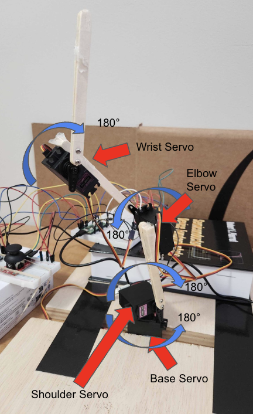

--- 
title: "Armold"
description: "Project Documentation a Robotic Arm"
layout: default
---

# Armold

<iframe width="560" height="315" src="https://www.youtube.com/embed/8_QH_XWPAGs" title="ECE 4160: Lab 8 Fast Drift" frameborder="0" allow="accelerometer; autoplay; clipboard-write; encrypted-media; gyroscope; picture-in-picture; web-share" allowfullscreen> </iframe> 

## Non-Technical Overview

"Armold" is the name of my robot arm project. You can move the arm by either playing with joysticks and tilting the controller I built, or by using a camera to detect an AprilTag (which looks like a QR code) and the arm tries to go wherever the AprilTag is.

## Technical Overview

* [Introduction](#introduction)
* [Hardware: Sensors, Actuators](#hardware)
* [Software: Servo Control, TCP, Numerical IK](#software)
* [Brief Technical Aspects](#brief-technical-aspects)

### Introduction


For my final project of SYSEN 5410, I decided to build a simple, 3-DOF robotic arm. This is a continuation of an independent project that I had been working on for a couple of months, and this class helped me get a lot done on it.

The arm is made up of four separate servo motors, and changing the angles at which the servo motors are set changes the (x,y,z) position of the arm’s end effector in the global reference frame. The arms reachable domain is essentially a hemisphere centered at the base of the robot arm, which is stationary.

There are two methods with which I can change the servo motor angles to move the end effector. The first, simpler method is using sensor input in order to directly alter the goal angles that the servos are trying to move to. This is done through the usage of an IMU and two Joystick sensors. One joystick alters the base and shoulder servo motor angles, the other joystick alters the elbow servo motor angle, and the roll of the IMU alters the servo motor angle of the wrist. With these controls, one can move the arm around.

The second method of changing the servo angle is decoupled from the first, so both cannot be simultaneously run. This method uses a stationary camera to detect an AprilTag that is near the robotic arm. Once detected, transform the position of the AprilTag from the camera’s reference frame to the global reference frame, and I then run a  numerical Inverse Kinematics (IK) algorithm on this new position to determine what servo angles are required to place the end effector at the same position as the AprilTag. This happens continuously until the user switches back to the first method of changing the servo angles by pressing a button connected to the Pico 2 W. Pressing this button toggles back and forth between the two methods.

Overall, the design approach is simple. Firstly, I needed a way to change the position of the arm through both the configuration space and the state space. The configuration space requirement was achieved via the joysticks and the IMU, and the numerical IK allows me to change the servo goal angles using state space inputs as well. Secondly, I needed to determine how to properly implement these changed goal angles so that the arm moved relatively smoothly and I could easily jump between the two methods.

This project was interesting because it combined classic robotics fundamentals (transformation matrices, forward kinematics, inverse kinematics, and Jacobians) with manual and computer vision based control. This created a fun, simple, yet sophisticated robotics project that could present a relatively low cost barrier of entry into robotics.

### Hardware

#### Sensors

My system uses four types of sensors: an IMU, a push button, a joystick, and a camera.

##### IMU Setup

An Inertial Measurement Unit (IMU) allows one to measure linear acceleration and angular velocity. For this project, I used the MPU6050. It is a device that communicates with the I2C protocol, so it is necessary to set up an I2C channel on the Pico 2 W properly. I connect the IMU to I2C channel 0. The SDA GPIO number is 8, and the SCL GPIO number is 9. I set the I2C channel frequency to 400kHz. Additionally, I connect the IMU’s power pin to the Pico 2 W’s 3.3V output pin, and I ground the IMU to GND.
	
I calculate the IMU’s roll using trigonometry on the IMU’s different acceleration measurements. I then use a scaled version of this roll value in order to change the goal angle of the wrist servo, which in turn causes that servo to move towards this new goal angle.

##### Push Button Setup

I used a push button in order to toggle between manual control of the servo goal angles and feedback control, as described in the introduction. I decided to make the button active low, meaning that when it is pressed it connects a digital input GPIO pin to GND. Otherwise, if it is not pressed, that pin should be held high. In order to do this, I program for there to be an internal pull up resistor on GPIO 6. I connect one side of the button to this pin, and the other side of the button to GND.

##### Joystick Setup

Each joystick has a set of axes. These axes are connected to potentiometers, which allow for the voltage output of each axis to change as the joystick’s position along one of those axes changes. Therefore, the joystick has an analogue output for each axis, and each axis requires an ADC on the Pico 2 W in order to use the output for computation. However, the Pico 2 W only has three GPIO enabled ADCs, so I was only able to use three out of the four axes. The ADCs are accessible through GPIOs 26, 27, and 28. I attached one joystick’s x-axis to 26, the same joystick’s y-axis to 27, and the other joystick’s y-axis to 28.

The joysticks need to be supplied with 5V, so I powered both in parallel through the VSYS port on pin 39. I additionally connected each joystick to GND.

##### Camera Setup

The camera, an EMEET SmartCam C960, was powered directly from my laptop via a USB connection. This connection additionally streamed the camera feed from the device onto my computer. No additional power supply or circuitry was needed to use this camera. It was set up off to the side of the robotic arm, and its position relative to the base of the robot was measured in inches.

#### Actuators

The only actuators in my system, the servo motors, were used for the arm mechanics to make the arm move. This movement was achieved by changing the angles at which the servo motors were set to.

##### Servo Motor Setup

For actuation, I used four MG996R servo motors. Each motor has a stall torque of 11kgfcm when powered with 6V, an operating voltage level between 4.8V and 7.2V, a running current of 500mA and a stall current of 2.5A (at 6V), a 180° range, and a mass of 55 g. Due to their potential to draw high current, as well as my desire to operate them at 6V in order to get the highest amount of torque out of them, it would have been unwise for me to try to power these servos through the Pico 2 W. Instead, I purchased an AC to DC converter, taking in power from a standard US wall outlet (120VAC, 60Hz) and converting it to a 6VDC source with a maximum supply of 10A. Given that I had four servo motors that could theoretically each pull 2.5A, this barely met the required power configuration. However, it is unlikely in my robotic arm that any of the servos would be approaching their stall torque, let alone all of them at once, because the maximum amount of torque that any of them will experience is less than 11kgf*cm. I know this because the moment arms of the robot, as well as the mass of the servos and linkages, are too small to surpass this threshold. This was checked mathematically. Additionally, in its current state, the arm does not pick anything up.

I powered all four servos in parallel to the output of this power supply, and across each servo power terminal I placed a 100uF capacitor. This was placed there to both smooth the input voltage and current of the servo, as well as reducing the amount of electrical noise the servo may place into the system. 

To control the angle at which the servo motor turned to, each motor had to receive its own PWM signal. I used GPIO 13 to output this analogue signal for the base servo, GPIO 18 for the shoulder, GPIO 16 for the elbow, and GPIO 15 for the wrist. Each of the PWM signals were set to a frequency of 50 Hz, and duty cycles between roughly 1 ms and 2 ms corresponded with the servo angles of 0° and 180°. The above duty cycle range wasn’t fully accurate and needed to be slightly tuned, but that is the general idea.

# 

### Software

At the heart of this program lies the servo movement loop. This loop continuously runs, calculating the error between the current angle of each motor and that motor’s goal angle, and then slowly moving the servo closer to the goal angle while also updating the servo’s current angle. The error was multiplied by a constant in order to properly scale the effect of the error, and this was tuned based on trial and error while visualizing the speed and stability of the servo movement.

```python
async def servo_loop():
   global target_base, target_shoulder, target_elbow, target_wrist, curr_base, curr_shoulder, curr_elbow, curr_wrist
   gain = 0.01
   while True:
       curr_base += gain * (target_base - curr_base)
       curr_shoulder += gain * (target_shoulder - curr_shoulder)
       curr_elbow += gain * (target_elbow - curr_elbow)
       curr_wrist += gain * (target_wrist - curr_wrist)


       base.duty_u16(angle_to_duty(curr_base))
       shoulder.duty_u16(angle_to_duty_shoulder(curr_shoulder))
       elbow.duty_u16(angle_to_duty(curr_elbow))
       wrist.duty_u16(angle_to_duty_wrist(curr_wrist))


       await asyncio.sleep(0.01)
```
The fun part of the software is in determining how to change the “target”, or goal, angle values.

In the manual operation mode, these values are updated by the sensor inputs from the joysticks and the IMU. I low-passed all of these sensor measurements in an attempt to reduce the amount of noise in the signal, and then scaled them appropriately so a large change in the sensor output would create a small change in the target goal angle for each servo. The processed IMU output changed the target for the wrist servo, the processed output from GPIO 26 changed the target angle of the base servo, the processed output from GPIO 27 changed the target angle of the shoulder servo, and the processed output from GPIO 28 changed the target servo of the elbow servo. Additionally, I found that for manual control, the change in the target angle was so small that it would instantaneously move to the target with little angular change, so I automatically set the value of the target angles to the values of the current angles. The sensors only updated the target goal angles if “currently_pressed” was true, which was a global flag that tracked which operation mode the robot arm was in.

```python
async def sensor_input():
   global target_base, target_shoulder, target_elbow, target_wrist, curr_base, curr_shoulder, curr_elbow, curr_wrist
   acc_roll = 0
   right_x_value = 0
   right_y_value = 0
   left_y_value = 0
   while True:
       if run_sensors:
           ay, az = mpu.accel.y, mpu.accel.z
           acc_roll = 0.3*math.degrees(math.atan2(ay, az)) + 0.7*acc_roll   
           if abs(acc_roll) <= (5):
               change = 0
           else:
               change = acc_roll/5
           right_x_value = 0.4*right_x_adc.read_u16() + 0.6*right_x_value
           right_y_value = 0.4*right_y_adc.read_u16() + 0.6*right_y_value
           left_y_value = 0.4*left_y_adc.read_u16() + 0.6*left_y_value
           if currently_pressed: # indicates that manual operation mode is engaged
               curr_base = clip(curr_base - normalize(right_x_value), 0, 180)
               curr_shoulder = clip(curr_shoulder + normalize(right_y_value), 0, 180)
               curr_elbow = clip(curr_elbow - normalize(left_y_value), 0, 180)
               curr_wrist = clip(curr_wrist + change, 0, 180)
               target_base = curr_base
               target_shoulder = curr_shoulder
               target_elbow = curr_elbow
               target_wrist = curr_wrist
       await asyncio.sleep(0.02)
```
	
Using “async” functions allowed for multiple processes to be run at the same time, which is how I was able to both update the target goal angles and move the servos towards these angles.

When “currently” pressed was false, the sensors were no longer able to affect the behavior of the servos. In this scenario, the Pico 2 W sent a “start” command to my laptop over the TCP connection to indicate to my laptop that it should start converting AprilTag positions from the camera frame to the robot’s base frame, and then running numerical IK on that. I did all of the forward and inverse kinematics on my laptop because it is computationally intensive. When the Pico 2 W sends over the “start” command, a global flag on my laptop called “send_AprilTag_stuff” gets set to high.

Once “send_AprilTag_stuff” is high, my laptop takes the AprilTag’s position in the camera’s frame of reference, converts the units from meters to inches, and then checks if the current AprilTag position is within the reachable space of the robot arm. If it is, then the laptop performs numerical IK until a position is reached that is within 1 inch of error of the AprilTag’s position. Once the angles are calculated that achieves this accuracy, the laptop sends over these angles to the Pico 2 W which then updates the servos’ target goal angles. The following is the camera streaming logic.

```python
async def camera_stream(writer):
   global CAMERA_INDEX, arm_moving, Camera_params, tag_size, curr_x, curr_y, curr_z, curr_base, curr_shoulder, curr_elbow, curr_wrist, alpha
   global l1, l4, l7, l10
   global send_AprilTag_stuff
   detector = Detector(families="tag36h11")
   cap = cv2.VideoCapture(CAMERA_INDEX)
   T_camera_to_base = np.array([[0,0,-1,18.25],
                              [1,0,0,6.4375],
                              [0,-1,0,7.125],
                              [0,0,0,1]])
   try:
       while True:
           ret, frame = cap.read()
           if not ret:
               continue
           gray = cv2.cvtColor(frame, cv2.COLOR_BGR2GRAY)
           h, w = gray.shape
           results = detector.detect(
           gray,
           estimate_tag_pose=True,
           camera_params=Camera_params,
           tag_size= tag_size
           )
           for tag in results:
               if tag.tag_id < 0 or tag.tag_id > 7:
                   continue
               if (send_AprilTag_stuff):


                   x = tag.pose_t[0,0]*39.3701
                   y = tag.pose_t[1,0]*39.3701
                   z = tag.pose_t[2,0]*39.3701
                   aprilTag_camera = np.array([[x], [y], [z], [1]])
                   aprilTag_base = T_camera_to_base@aprilTag_camera
                   reach = np.sqrt((aprilTag_base[0,0]**2)+(aprilTag_base[1,0]**2)+((aprilTag_base[2,0]-l1)**2))
                   if not (reach > (l4 + l7 + l10 - 1)):
                       angle_output = numerical_ik(curr_base, curr_shoulder, curr_elbow, curr_wrist, epsilon, Lambda, aprilTag_base[0,0], aprilTag_base[1,0], aprilTag_base[2,0] + l1, 0)
                       curr_base = angle_output[0][0]
                       curr_shoulder = angle_output[1][0]
                       curr_elbow = angle_output[2][0]
                       curr_wrist = angle_output[3][0]
                       result = {"target": "servos", "theta1": np.degrees(angle_output[0][0]), "theta2": np.degrees(angle_output[1][0]), "theta3": np.degrees(angle_output[2][0]), "theta4": np.degrees(angle_output[3][0])}
                       await send_command(writer, result)
           cv2.imshow("AprilTag Detection", frame)
           if cv2.waitKey(1) & 0xFF == 27: # ESC to quit
               break
           await asyncio.sleep(0.01)
   except asyncio.CancelledError:
       cap.release()
       cv2.destroyAllWindows()
       raise
```
The inverse kinematics is done numerically as I was unable to find a clean geometric formulation for the IK. It follows the general formula for numerical IK, using the Jacobian and pseudo-inverse of the Jacobian of the robot arm. I have “epsilon” as 1 inch, so it is searching for a solution that is within 1 inch of error from the goal position. The variable “Lambda” represents how large of steps are taken with each iteration of the numerical IK loop. I ended up using Lambda=5e-4 as I found that this allowed for the algorithm to reach a solution relatively fast, but it was still precise and provided good results that caused the arm to closely match the position of the AprilTag.

I calculated the form of both the forward kinematics and Jacobian by hand and have included them with the inverse kinematics algorithm in the Appendix, along with an image of the robot that I drew to reference when deriving the forward kinematics.

When the laptop calculated the new target angles and sent them in a command to the Pico 2 W, the Pico 2 W processed this command and set the new target angles to these values.

```python
async def on_command(payload, writer):
   global previously_pressed
   global currently_pressed
   global target_base, target_shoulder, target_elbow, target_wrist

   if (payload.get("target") == "servos"):
       theta1 = payload["theta1"]
       theta2 = payload["theta2"]
       theta3 = payload["theta3"]
       theta4 = payload["theta4"]
       target_base = theta1
       target_shoulder = theta2
       target_elbow = theta3
       target_wrist = theta4
       previously_pressed = 1
       currently_pressed = 1
```

This mode of operation continued until the user pressed the button once again, and then the operation mode switched. This means that the sensor input now changes the target angles of the servos, and even if the camera detected an AprilTag, the laptop would not run IK on its position and it would not send over new target angles. This mode of operation continued until the button was pressed once again, and so on and so forth.

### Brief Technical Aspects

#### Wireless Communication

I established a TCP connection between the Pico 2 W and my personal laptop to fulfill the wireless communication requirement. Both the Pico 2 W and my laptop were able to both send and receive data via this TCP connection. This was used to allow the Pico 2 W to inform my laptop when it should do IK on the AprilTag position and when not to, and it allowed my laptop to send servo angles to the Pico 2 W when the IK was being used.

#### Wired Communication

I established an I2C connection between the MPU6050 and the Pico 2 W over I2C channel 0 with SDA coming from GPIO 8 and SCL coming from GPIO 9 at 400kHz. After calculating and low-pass filtering the roll of the IMU, I divided the output by 5 so that the goal angle of the wrist servo only changed with small increments for larger changes in roll. Additionally, I created a deadband where a roll of 5 degrees would cause no change in the servo goal angle.

I used the ADCs on GPIOs 26, 27, and 28 to read different axes of the two joystick sensors. I convert the raw analog output to be from 0 and 65535, and then normalize this digital signal to be between -1 and 1 in order to change the goal angles of the servos in small increments. I created a deadband around the center of the joystick so that servo goal angles wouldn’t change when the joysticks weren’t pressed.

Both the IMU and the joysticks were read at a frequency of 50Hz.

The button provided a digital input into GPIO 6. It allowed the user to toggle between manual operation and AprilTag detection with numerical IK operation.

#### Analog-to-Digital Conversion

I use the three GPIO accessible ADCs on the Pico 2 W in order to take in the analog voltages from the joysticks and convert it into a usable digital signal, which I further process via a low-pass filter and scaling. The purpose of this was described in the “Wired Communication” section above.

#### Digital-to-Analog Conversion

I do four separate Digital-to-Analog conversions. Each conversion is done to produce a separate PWM signal, which is then sent to one of the four servo motors. These PWM signals have a base frequency of 50 Hz, and a duty cycle from about 1ms to 2ms, corresponding to an operating range of about 0° to 180°. The exact duty cycle for these angles was a little bit different for each servo, but in general they fell in about this range. I use the PWM signals to change the angles at which the servos in the arm are set, therefore moving the position of the end effector.

#### State Estimation/Filtering

I low-pass filter all of the joystick readings, as well as the acceleration data. For the joysticks, I use ɑ=0.4, and for the IMU I use ɑ=0.3. These values allowed me to reduce the large amount of noise in both signals while also not accumulating too much delay. This was important because it was functionally important for the user to feel that the arm is reacting in real time to their manipulation of the roll of the IMU and the joysticks.

#### Feedback Control

For both the manual operation mode and the AprilTag detection operation mode, each servo motor moved to their goal angles by moving in a way that reduced the error between their current angle and their goal angle. In this sense, this was similar to a proportional controller since the movement speed was dependent on the error. If the error was zero, the servo would not move. However, I could not actually sense the current angles of any of the motors because I could not access their internal potentiometers, so there was no direct sensor feedback on the servo angles. There was some sort of indirect feedback when operating in the AprilTag detection operation because the goal servo angles would change so that the arm’s end effector would be within the allowable buffer zone around the center of the AprilTag.

Inside each servo motor there exists its stand alone PID controller so that the servo moves to the correct angle as defined by the incoming PWM signal. However, I did not have access to alter this PID loop, so I can’t count it as feedback control that I implemented, even if it was present.

### System Level Diagram

# 
