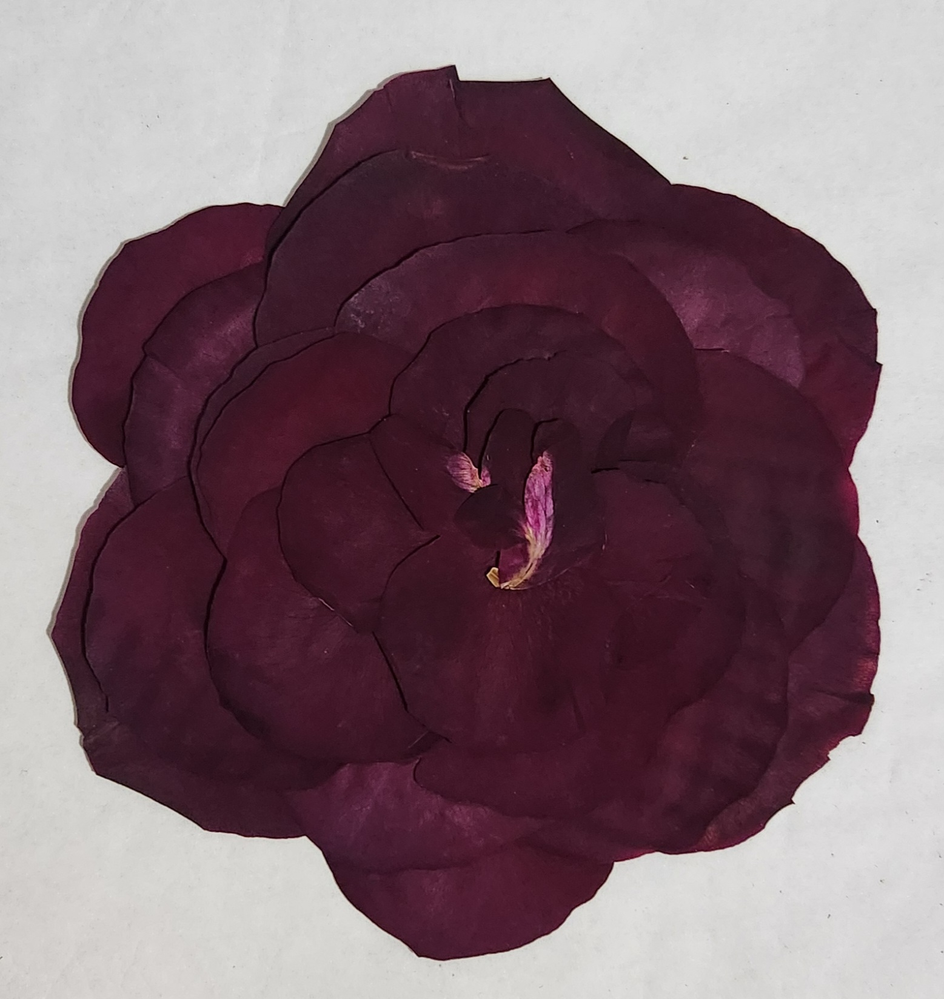

--- 
title: "Flower Press"
description: "Project Documentation for a Flower Press"
layout: default
---

# Flower Press

While not incredibly technical, this was still a fun and creative project to work on!

I had wanted to make a flower press like this for a while. The design, based on a similar press that belonged to my great grandma, is fairly simple. It is essentially a sandwich-like mechanism that presses flora in between the wooden planks in order to preserve them. I made this particular press as a gift.

## Initial Design

I started the project by scribbling down some ideas and drawings about what I wanted the press to look like, how the press would stay intact, and how the press would apply pressure in order to efficiently press the flowers or leaves placed in it.

 
 

 

I wanted the press to have multiple layers so that multiple flora could be pressed at the same time, which is why you see multiple stacks of wood in the bottom left of the above picture.

## Manufacturing

To build the press, I bought a couple of ¾”x2’x4’ pieces of wood. I then used a table saw to cut the wood into usable chunks, which were slightly larger than a standard piece of printer paper.

I taped together the best cuts so that their edges aligned as best as they could, and I used a drill press to create the holes for the bolts that would hold the whole contraption together.

 
 

 

I was then able to use the bolts, washers, and wing nuts to secure everything in place.

 
 

 

Finally, I used a bandsaw to further line up each of the individual pieces and sandpaper to smooth the entire surface.

 
 

 

## Beautification

After constructing the press, I did multiple rounds of staining the wood to create a rich color. I then bought some flower-themed stencils from Michaels and spray painted patterns onto the top of the press using various colors. To finish it off, I applied several layers of polyurethane to act as a protective coat.

 
 

 

 
 

 

## Usage

Here is a rose that I was able to press and later frame!

 
 

 

<!-- Load PyScript assets safely into your Jekyll page -->
<link rel="stylesheet" href="https://pyscript.net" />

  
<strong>🌸 Flower Press Simulator Terminal:</strong> Click inside to type.

  
  

