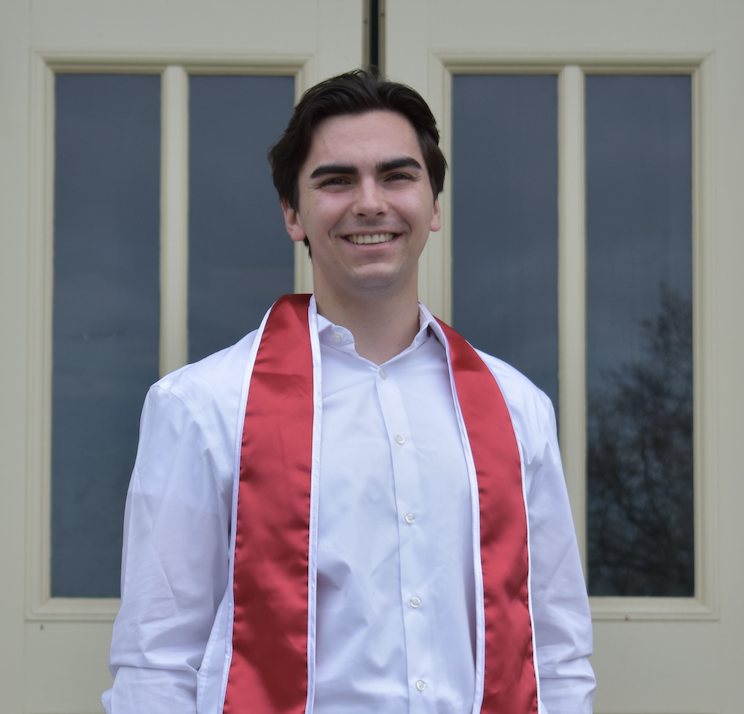

# About Me

  
  

    My name is Hilario (Lalo) Esparza, and I am an engineering student attending Cornell University. I recently graduated with my B.S. in Electrical and Computer Engineering from Cornell, and I am now completing my M.Eng. in Systems Engineering, with a focus on robotics. While I have many interests, I find robotics to be a wonderful blend of controls, state estimation, cyber-physical systems, and hardware and software development and debugging. Particularly, I find swarm, bio-inspired, and field robotics to be very intriguing fields with loads of potential for the automotive, space, agriculture, and medical industries.
  

# Projects

* [A Fast Robot Car](https://hilarioesparza.github.io/fastrobots-2026/)
* [Armold: My 3-DOF Robot Arm](Pages/armold.md)
* [A Bio-Robotic Gardner](Pages/bee3900.md)
* [A PID Controlled Drone Motor](Pages/drone_motor.md)
* Li-Air Battery Electrolyte Research
* Non-linear Control for a Tethered Robot Swarm
* Amphibious Robot for Wetland Exploration
* A Custom Flower Press
